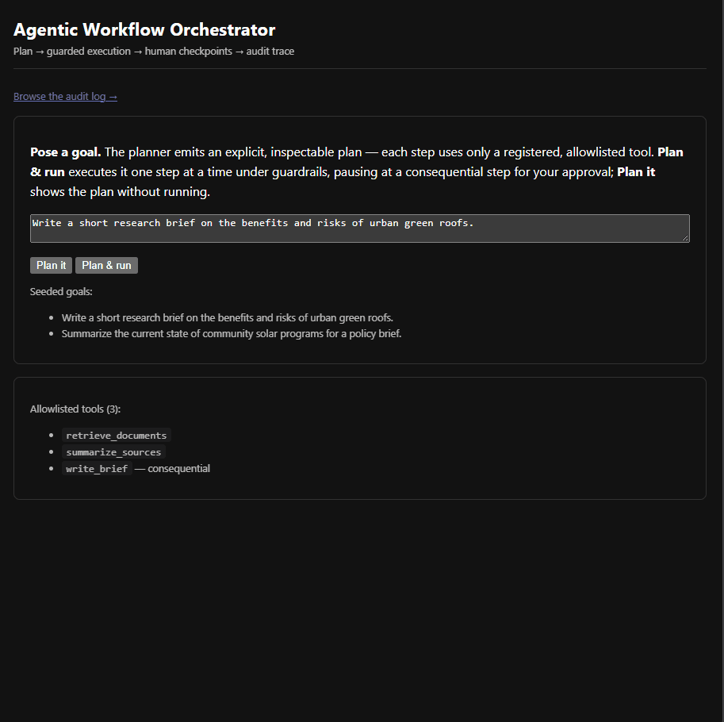

<!--
Agentic Workflow Orchestrator — case study draft for tjromack.com/work/agentic-workflow-orchestrator.
Written to the site standard (cf. /work/mcp-suite): metadata block, then Overview · The Problem ·
Constraints · Architecture · Key Decisions · How It's Verified · What I'd Do Differently · Limits · Closing.
Mixed first/third person, past tense, terse. Voice per repo CLAUDE.md: state the numbers, no honesty-signalling.
Every figure is reproducible from the repo — `make guardrails`, `make test`, EVAL.md.

Image: docs/agent-orchestrator-demo.gif lives in this folder; the path below is relative to it — repoint to
the site's asset path when porting into the site repo.
-->

# Agentic Workflow Orchestrator — the planner proposes, guardrails and a human dispose

**Shipped:** Aug 2026 · hardened Sep 2026
**Demonstrates:** running an agent under enforced guardrails — a step budget, retry-then-halt, a human checkpoint on consequential steps, schema-validated output, and an allow-listed registry — with every guardrail exercised and published
**Lenses:** Applied AI (primary)
**Stack:** python · fastapi · jinja · htmx · sqlite · anthropic-api

> An agent that plans a goal into an inspectable sequence of tool calls and runs them one step at a time behind five
> guardrails — a step budget, retry-then-halt, a human checkpoint on consequential steps, schema-validated output, and
> an allow-listed registry — with every guardrail exercised and published, and every step written to a replayable audit
> trace.

## Overview

The orchestrator turns a goal into an explicit, inspectable plan and then executes it one step at a time. A tool
registry defines the only tools the agent may call; a planner proposes an ordered plan that uses only those tools; an
executor runs each step, resolving references to prior outputs, validating each output against its schema, and enforcing
a step budget and retry policy; and a consequential step pauses for human approval before it runs. Every step and every
guardrail decision is written to an append-only audit trace, so a completed or halted run can be reconstructed after the
fact. Swap the tools and the same core drives a different job.

The design choice the project is built around is where the model's authority ends. The planner may *propose* a plan,
but it has no authority over what actually runs: the executor only calls allow-listed tools, only within a step budget,
and never runs a consequential action without a human's approval. The interesting engineering is not the planning — it
is the control-flow that contains it.

*`Plan & run` on a goal: the planner emits an inspectable three-step plan, the executor runs it one step at a time, and
it pauses at the consequential `write_brief` step for human approval — nothing irreversible runs until you approve.*

## The Problem

An agent that can call tools on a user's behalf is only as trustworthy as the limits it will not cross. The failure
modes are specific and known: it loops forever, it calls a tool it was never given, it runs an irreversible action
before anyone can stop it, or it passes one tool's malformed output into the next and corrupts the run. A demo that
ignores these looks impressive and is unshippable.

The work, then, is not making an agent *act* — a single model call can do that. It is making an agent act **inside
bounds a human and a reviewer can see and trust**, and being able to show that each bound actually holds.

## Constraints

- **Synthetic and public tools only** — no PHI, no internal systems. The demo tools are deterministic stubs over a
  local corpus.
- **Detection and execution had to be deterministic and auditable.** In a regulated context, *why* a step ran — and why
  another was stopped — must be inspectable, so the guardrails are plain control-flow, not model judgment.
- **The model gets no authority over what runs.** The planner proposes; the allow-list, the budget, the schema checks,
  and the human checkpoint decide.
- **A consequential action must not run without approval.** The executor pauses at such a step and waits.
- **The demo has to run offline.** With no key the planner falls back to a deterministic plan, so the whole flow works
  without a provider.

## Architecture

The core is four parts. A **registry** holds the allow-listed tools, each with an input and output JSON schema. A
**planner** turns a goal into an ordered plan — an LLM proposes one as JSON, or a built-in deterministic planner emits
the canonical plan when no provider is configured — and the plan is validated against the registry before anything runs.
An **executor** runs the plan one step at a time: it resolves `{"$ref": "stepN.field"}` references against prior
outputs, validates each output against its schema, retries a transient tool error up to a limit and then halts, refuses
a plan beyond the step budget, and pauses at a step flagged `consequential` (`AWAITING_CHECKPOINT`) until a human
approves or rejects via a resume action. An **audit** layer writes every step and guardrail event to an append-only
trace with per-step timing.

The guardrails are deterministic control-flow, exercised on deterministic tools — there is no model call in the
guardrail path. That is deliberate: the point of a guardrail is that it fires the same way every time, which a model
cannot promise.

The plan validation is where the planner's freedom meets the registry's rules. A plan that names a tool outside the
allow-list, or wires a reference of the wrong type into a step's input, is rejected before execution — the same static
check whether the plan came from the model or the fallback.

## Key Decisions

1. **Plan-then-execute, not a single-shot agent.** The plan is emitted and inspectable before anything runs, and the
   executor drives it deterministically. The tradeoff is less open-ended autonomy — which, for a workflow that touches
   consequential actions, is the point.
2. **The model plans; guardrails and a human dispose.** The LLM's proposed plan has no authority: the executor calls
   only allow-listed tools, stays within a step budget, and stops at a consequential step. The tradeoff is that the
   planner's own quality is a separate concern — handled by decision 4.
3. **A human checkpoint on consequential steps.** A step marked consequential pauses until a person approves, so the
   human decides before an irreversible action rather than reviewing after it. Decisions are an append-only trail, not
   an in-place status. The tradeoff is that the run is not fully autonomous — by design.
4. **An invalid LLM plan falls back to deterministic; a disallowed tool does not.** When the model wires otherwise-valid
   tools together with a type-mismatched reference, the planner falls back to the always-valid deterministic plan and
   stamps the substitution in the trace. But a plan naming a tool outside the allow-list is *rejected*, never swapped for
   a safe one — the model reaching for a tool it was not given is exactly what the allow-list exists to surface.
5. **Every run is a replayable audit trace.** Each step and guardrail event is persisted with timing, so a completed or
   halted run can be reconstructed. The tradeoff is the persistence overhead, which buys the difference between a demo
   and something operable.

## How It's Verified

`make guardrails` exercises every guardrail on a constructed plan and prints the outcome; the same behaviour is asserted
case-by-case in the test suite. Real output — every guardrail fires as designed:

| Scenario | Guardrail | Outcome |
|---|---|---|
| Normal run, checkpoint approved | — | completed (3/3 steps) |
| Consequential step, no approval | human checkpoint | pauses (`awaiting_checkpoint`) |
| Consequential step, rejected | human checkpoint | halted |
| Plan over the step budget (5 > 3) | step budget | halted |
| Tool fails every attempt (retry ×2) | retry-then-halt | failed |
| Tool output violates its schema | schema validation | failed |
| Plan calls an unregistered tool | allow-listed tools | failed |

Every step is timed in the audit trace (each step on a persisted run carries a recorded `duration_ms`), and the
automated suite is **54 tests** — including the fresh-clone case: `pytest` passes cold, without a seed.

## What I'd Do Differently

The rough edge worth naming showed up only with a real provider: a reviewer posing a free-form goal could hit a raw
"this plan would fail at run time" error when the model wired a reference of the wrong type. The guardrail was right —
the plan really would have failed — but surfacing it as a dead-end was the wrong experience for a tool whose story is
the guardrails, not the planner's wiring. The fix was to distinguish two cases that had been one: a **type-mismatched
reference** is a recoverable wiring mistake, so the planner now falls back to the deterministic plan and records that it
did; a **disallowed tool** is a signal, so it stays a hard rejection. The judgment was in *not* softening the allow-list
to fix the UX — the two failures look similar and must be handled oppositely. I would build that distinction in from the
start next time.

## Limits

- **It orchestrates control-flow; it does not judge task quality.** The eval proves the agent stops when it should — not
  how good the resulting brief is (that is the evaluation harness's job).
- **The demo tools are deterministic stubs** over a local corpus, and the planner runs offline in the demo. Real tools
  and a real planner add their own failure modes — which is what the guardrails exist to contain.
- **`max_steps` and `max_attempts` are configured, not learned** — sensible per-run defaults, not tuned against a
  workload.
- **Not a multi-agent system.** It is a single planner-executor loop with a human checkpoint, not agents negotiating.
- **Synthetic / public data and tools only** — no PHI, no internal systems.

## Closing

The repo is linked at the top of this page. `make guardrails` prints the behaviour table above — every guardrail on a
constructed plan, with the event it fires — and it, like the whole demo, runs offline with no key. `EVAL.md` lays out
each guardrail and why it exists, and the run view shows a live plan pausing at its human checkpoint.
